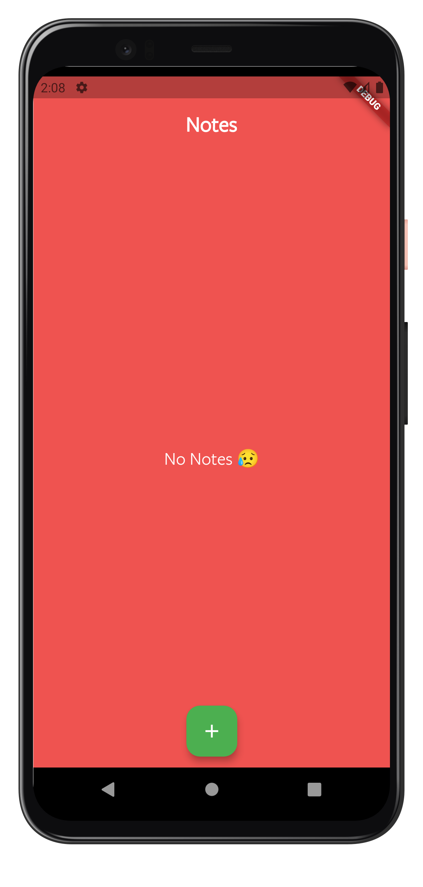
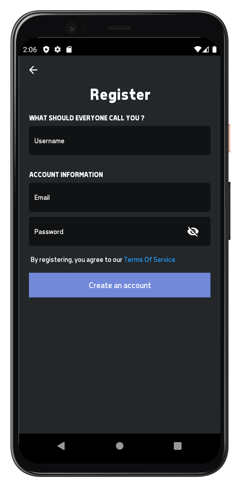
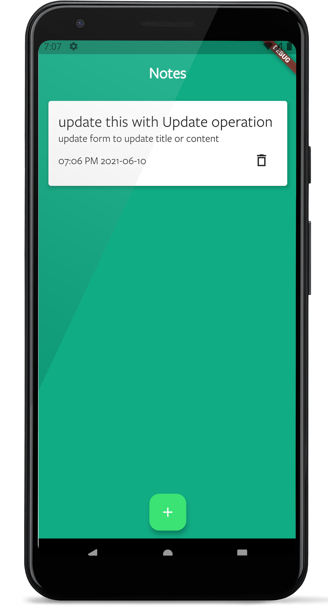

# Flutter Source Codes

    - Some Flutter apps that I code for tutorials or learning

## `Local Notes App`

 A Notes app made using local database `hive`.

## `Login UI`

 A Login UI app that currently has discord login UI.

## `Local Sqflite Notes App`

Using `sqflite` to create a simple notes app. The database helper class can be used to manage your own data.

