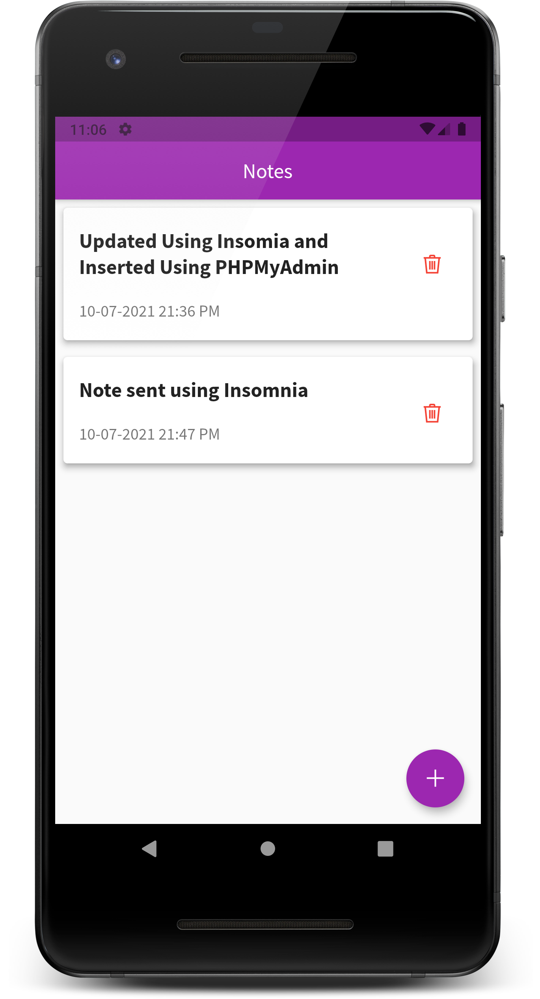

# `Complete Notes App`

Using `flutter` and `PHP` to create a notes app.

# `Using it`

    1. make sure you have xamppp installed.
    2. Create a table named notes with structure mentioned in db.php.
    3. Change db.php, if you are using a different database, or serverusername and password.
    4. start server and database.

    5. Make sure you have flutter 2.0+ installed.
    6. switch to notes app directory.
    flutter run.

# `Screenshots`

