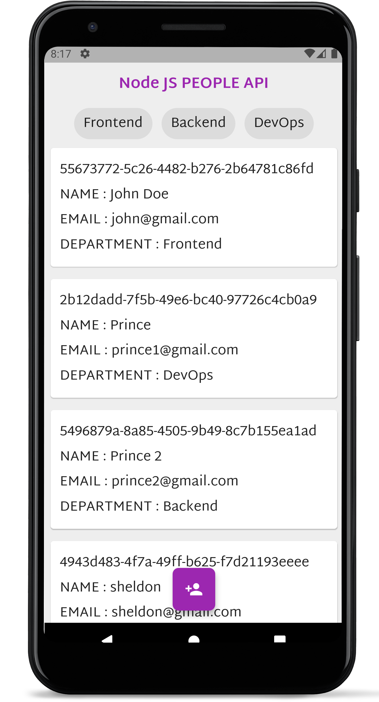

## `Flutter Node js API and Client Side Data Filtering`

Using `flutter` and `NODE` to create a peoples app. ave talked about `solving future builder automatically refiring issue` and `Client side data filtration`.

